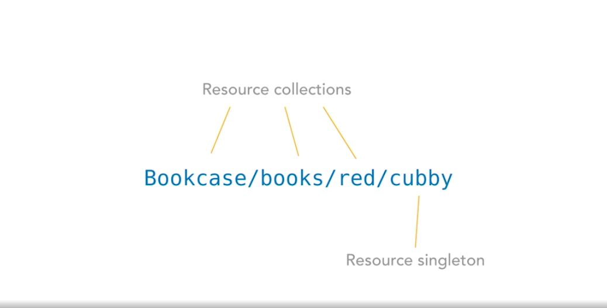

# REST APIs
`RE`presentational
`S`tate
`T`ransfer
  
`A`pplication
`P`rogramming
`I`nterface


## Difference between *Websites* and *Web applications*
- Websites work by asking the server a new **HTML document** that is made ***in the server*** by the **Developer**/**Content Management system (CMS)** and then rendered in te **Browser**.
- Web applications work by downloading **components**, HTML framework, Style sheets, and JavaScript. Then, when the user needs a new content, the application sends a `URI` (Uniform Resource Identifier) to the serves which after sends the data that will be used to build the nex state.

## URL vs URI

- `URI` (**Uniform Resource Identifier**): "A compact sequence of characters that identifies an abstract or physical resource" thhat "provedes a simple and exensible means for indentifying a resource"
- `URL` (**Uniform Resorce Locator**): "Is a subset of the `URI` that identifies a resource and explains **how to access** that resource by providing an explicit method like `https://` or `ftp://`

## The 6 constraints of REST
  
### 1. **Client-server architecture**
The client manages user interface concerns while the server manages data storage concerns.
  
### 2. **Statelessness**
No client context or information, aka "state", can be stored on the server between requests.
  
### 3. **Cacheability**
All REST responses must be clearly marked as cachable or not cachable.
  
### 4. **Layered system**
The client cannot know, and shouldn't care whether it's connected directly to the server o to an intermediary like a CDN or mirror.
  
### 5. **Code on demand**
Servers are allowed to transfer executable code like JavaScript and compiled components to clients.
  
### 6. **Uniform interface**
  
#### 6.1 Resource identification in request
The `URI` request must specify what resource it is looking for and what format the response should use.
  
#### 6.2 Resource manipulation through representations
Once a client has a representation of a resource, it can modify or delete the resource

#### 6.3 Self-descriptive messages
Each representation must describe its own data format.

#### 6.4 Hypermedia as the engine of application state
Once a client has access to a REST service, it sohuld be able to discover all available resources and methods thorough the hyperlinks provided.


## Anatomy of a REST request

GET
```
GET /wp-json/wp/v2/post/ HTTP/1.1
Host: appsite.dev
Content-Type: application/json
Authorization: Basic kdsfslkdflskdjfslkd
Cache-Control: no-cache
```
POST
```
POST /wp-json/v2/posts HTTP/1.1
Host: appsite.dev
Authorization: Basic Morten pass
Content-Type: application/json
Cache-Control: no-cache

{
    "title": "Angela creates a new task generated from the REST API",
    "content": "This is the content for the new post.",
    "author": 10,
}
```

## Resource



## Response

To get just the **HEAD** do a `HEAD` request.